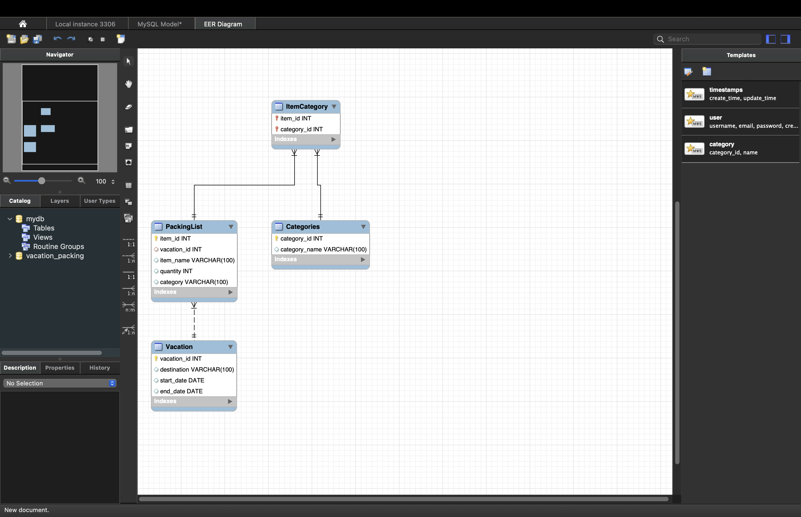

Certainly! Here's the design of the database schema using markdown:

# Question 1
```
1. (50 Points) Design a database schema that keeps track of what you need to pack
to go on vacation to the beach for a week. You must:
● (15 Points) List out the schema definition for at least three relations.
● (5 Points) Select appropriate types for each column, and include them in
your schema definitions.
● (10 Points) List all the super keys, the candidate keys and the most
reasonable primary key of each relation. Please ensure you justify your
primary key choice.

```

**1. Relation: Vacation**
Columns:
- `vacation_id` (Primary Key): INT (Unique identifier for each vacation)
- `destination`: VARCHAR(100) (The name of the beach location)
- `start_date`: DATE (The start date of the vacation)
- `end_date`: DATE (The end date of the vacation)

Super Keys: `{vacation_id}`, `{destination, start_date}`, `{destination, end_date}`
Candidate Keys: `{vacation_id}`
Primary Key Choice Justification: The `vacation_id` uniquely identifies each vacation and is the most reasonable choice for the primary key.

**2. Relation: PackingList**
Columns:
- `item_id` (Primary Key): INT (Unique identifier for each item)
- `vacation_id` (Foreign Key): INT (Relates to the `vacation_id` in the Vacation relation)
- `item_name`: VARCHAR(100) (The name of the item to pack)
- `quantity`: INT (The quantity of the item to pack)
- `category`: VARCHAR(100) (The category of the item, e.g., clothing, toiletries, accessories)

Super Keys: `{item_id}`, `{vacation_id, item_id}`, `{vacation_id, item_name}`
Candidate Keys: `{item_id}`
Primary Key Choice Justification: The `item_id` uniquely identifies each item and serves as the primary key to ensure uniqueness and efficient referencing.

**3. Relation: Categories**
Columns:
- `category_id` (Primary Key): INT (Unique identifier for each category)
- `category_name`: VARCHAR(100) (The name of the category, e.g., clothing, toiletries, accessories)

Super Keys: `{category_id}`, `{category_name}`
Candidate Keys: `{category_id}`
Primary Key Choice Justification: The `category_id` uniquely identifies each category and is the most reasonable choice for the primary key to ensure uniqueness and efficient referencing.

**4. Relation: ItemCategory**
Columns:
- `item_id` (Foreign Key): INT (Relates to the `item_id` in the PackingList relation)
- `category_id` (Foreign Key): INT (Relates to the `category_id` in the Categories relation)

Super Keys: `{item_id, category_id}`
Candidate Keys: `{item_id, category_id}`
Primary Key Choice Justification: The combination of `item_id` and `category_id` forms a composite key that uniquely identifies each item's category in the ItemCategory relation. This composite key serves as the primary key to ensure uniqueness and efficient referencing.

By organizing the schema with these relations and their corresponding columns, you can effectively track vacations, packing items, categories, and the relationships between them.
# Question 2 
```aidl
2. (50 Points) Use the database schema that you designed in the first question for
the following problems:
a. (10 Points) Write a create database statement for the database schema
you designed, using best practices discussed in class.
b. (30 Points) Write a create table statement for each of the relations you
designed. You must:
■ Include the primary keys
■ Ensure that your foreign key constraints are satisfied
■ Consider whether attributes should be nullable
c. (20 Points) Ceate a database schema diagram.
■ Use the Reverse Engineer tool in MySqlWorkBench
■ Ensure you include your foreign key relationships. You may need to
configure MySqlWorkBench: Model -> Relationship Notation ->
Connect to Columns
■ Please export the result as a pdf
d. (10 Points) Insert at least one tuple into each of your tables, using the
insert statement.
```

## The Create Database Statements

```
CREATE DATABASE vacation_packing;
USE vacation_packing;

-- Create Vacation table
CREATE TABLE Vacation (
  vacation_id INT PRIMARY KEY,
  destination VARCHAR(100),
  start_date DATE,
  end_date DATE
);

-- Create PackingList table
CREATE TABLE PackingList (
  item_id INT PRIMARY KEY,
  vacation_id INT,
  item_name VARCHAR(100),
  quantity INT,
  category VARCHAR(100),
  FOREIGN KEY (vacation_id) REFERENCES Vacation(vacation_id)
);

-- Create Categories table
CREATE TABLE Categories (
  category_id INT PRIMARY KEY,
  category_name VARCHAR(100)
);

-- Create ItemCategory table
CREATE TABLE ItemCategory (
  item_id INT,
  category_id INT,
  PRIMARY KEY (item_id, category_id),
  FOREIGN KEY (item_id) REFERENCES PackingList(item_id),
  FOREIGN KEY (category_id) REFERENCES Categories(category_id)
);

```

# Reverse Engineering the Data base Schema



# Inserting Tuples into the Database
```
-- Inserting a tuple into the Vacation table
INSERT INTO Vacation (vacation_id, destination, start_date, end_date)
VALUES (1, 'Beach Paradise', '2023-07-10', '2023-07-17');

-- Inserting a tuple into the PackingList table
INSERT INTO PackingList (item_id, vacation_id, item_name, quantity, category)
VALUES (1, 1, 'Sunscreen', 2, 'Toiletries');

-- Inserting a tuple into the Categories table
INSERT INTO Categories (category_id, category_name)
VALUES (1, 'Clothing');

-- Inserting a tuple into the ItemCategory table
INSERT INTO ItemCategory (item_id, category_id)
VALUES (1, 1);

```

